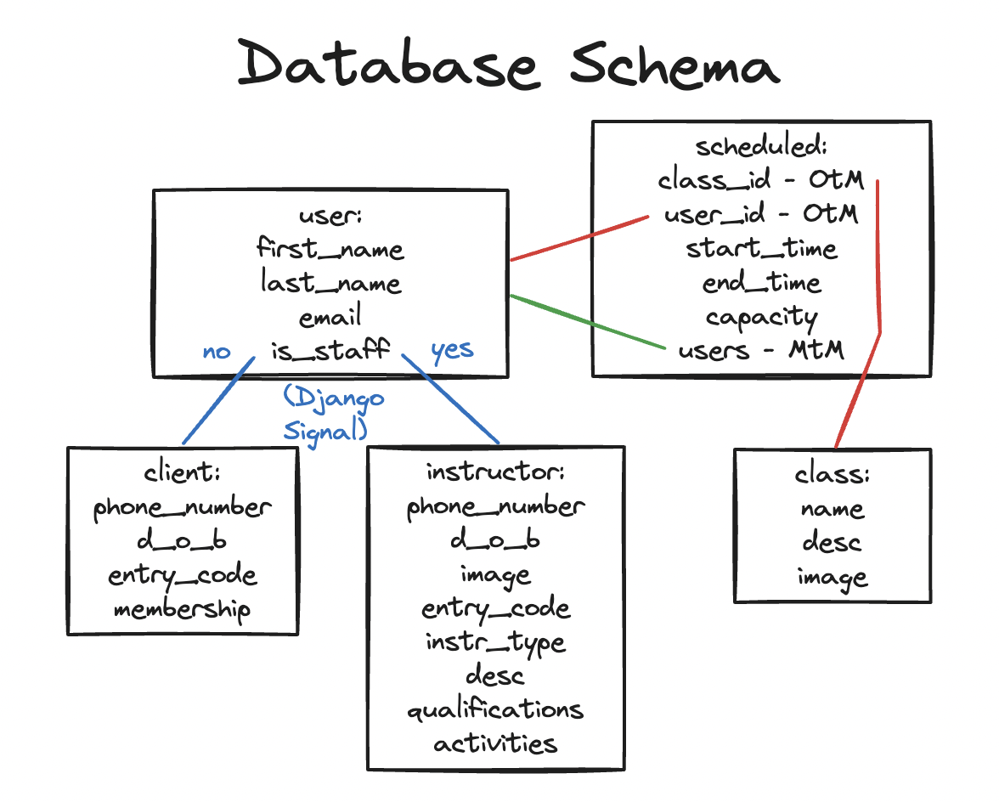

## About

Welcome to DjangoGym! After learning the fundamentals of Django - Views, URL Patterns, Admin Panel, Templates, Authentication, Django Signals, Class Based Views - I'm now putting it all together with a little project to create a gym web app. In this project I will use these skills I've learnt as well as explore new features such as many-to-many relationships, the use of the is_staff column in the User model, and much more. Below is the schema I have designed for this project.

    

