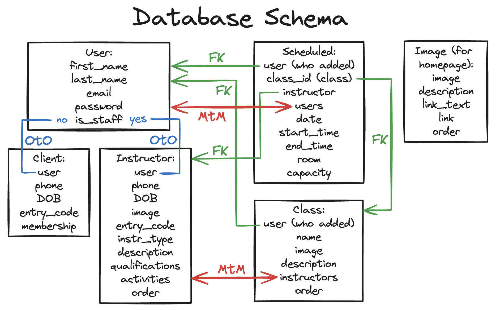
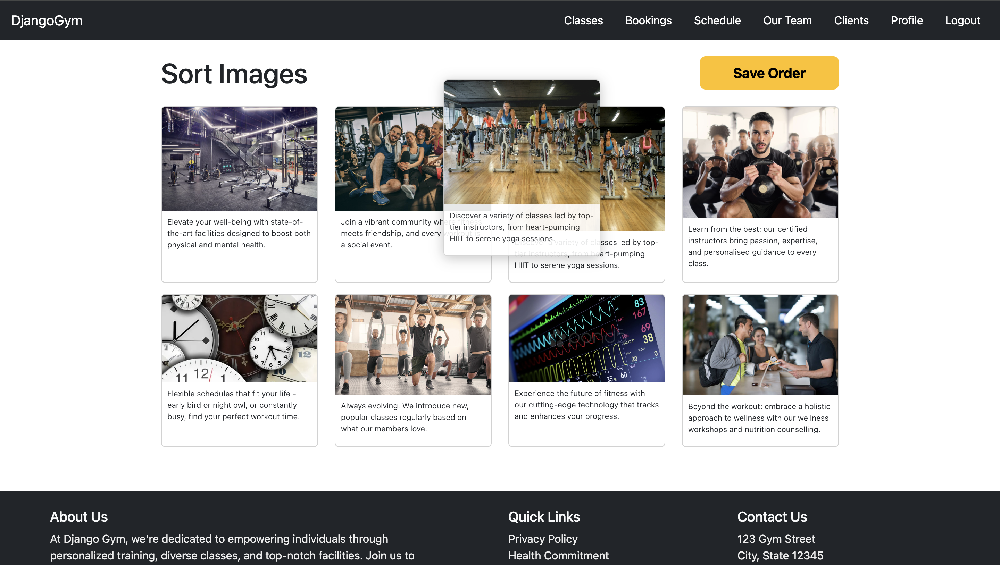
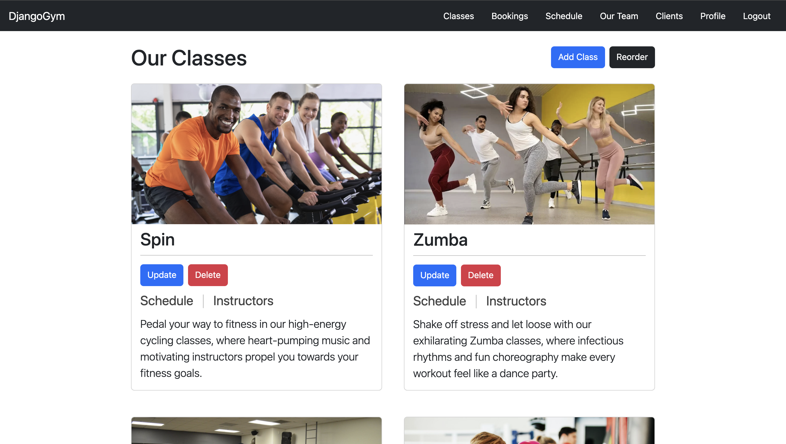
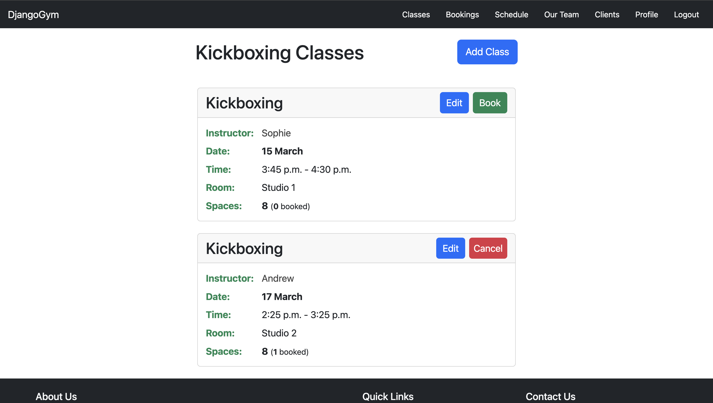
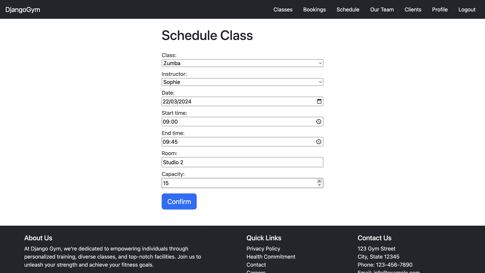
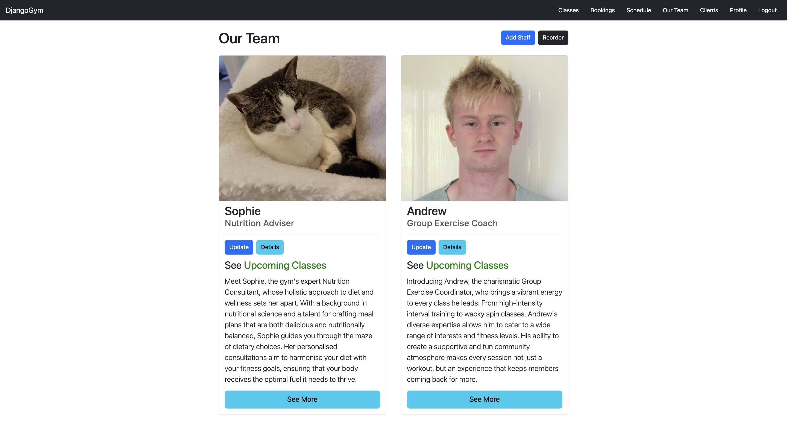
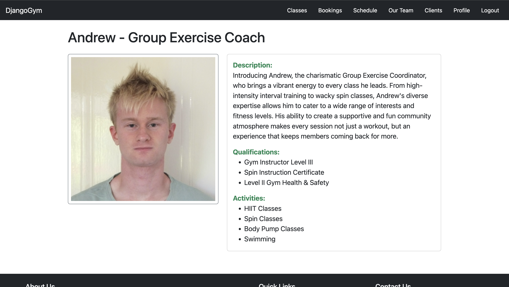
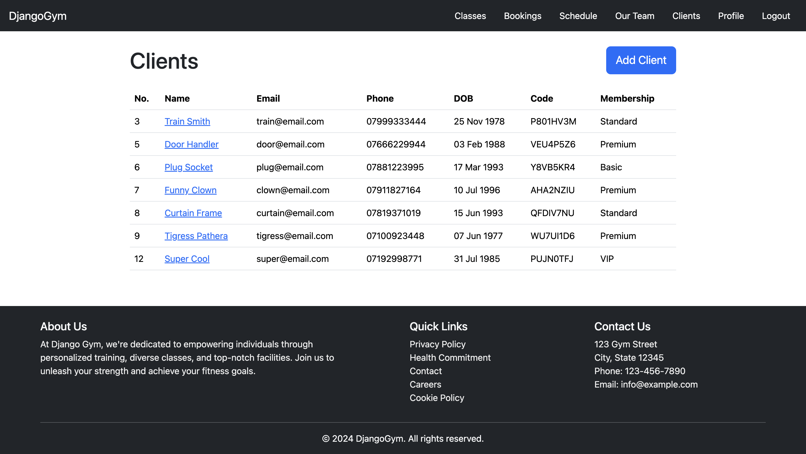
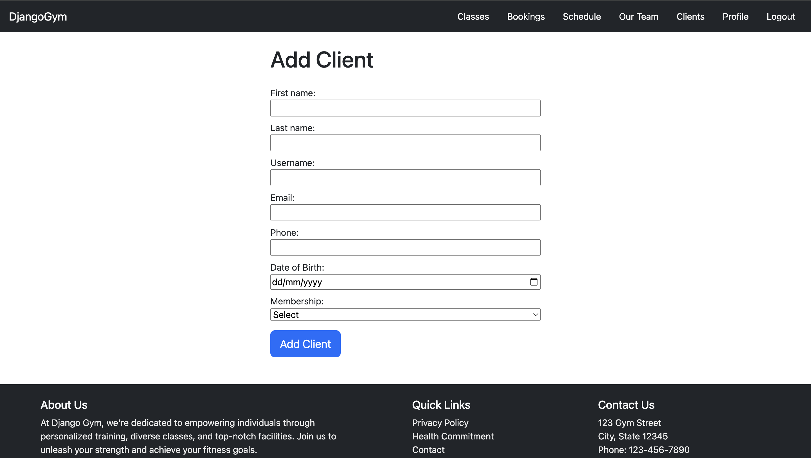
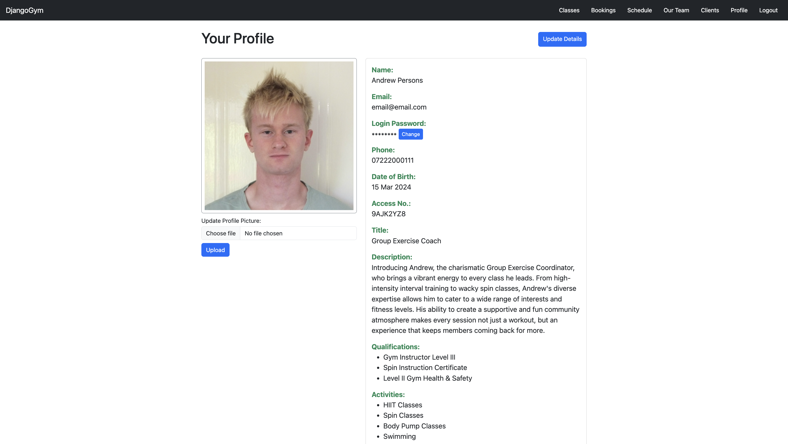

# About

[Jump to Key Technologies](#key-technologies)
[Jump to Key Images](#peek-at-the-pages)
[Jump to Key Installation & Setup](#installation--setup)

Welcome to DjangoGym! After learning the fundamentals of Django - Views, URL Patterns, Admin Panel, Templates, Authentication, Django Signals, Class Based Views - I'm now putting it all together with a little project to create a gym web app. In this project I will use these skills I've learnt as well as explore new features such as many-to-many relationships, the use of the is_staff column in the User model, and much more. I have designed this app with a lot of features, buttons and routes, this is because I want to give myself the chance to practice and learn through a good amount of repetition of simply getting things done in Django. Below is the schema I have designed for this project.

<p align="center">
    
</p>

# Key Technologies

- **Backend:** Python, Django, PostgreSQL
- **Frontend:** JavaScript, SortableJS, Bootstrap, CSS, HTML
- **Deployment:** Docker

# Peek at the Pages

Have a quick look at the pages on the website. These screenshots have been taken while logged in as a staff member, meaning all the buttons to add, edit and delete content are present.

## Homepage
<p align="center">
    
</p>

## Reordering the Homepage Images
<p align="center">
    
</p>

## Classes Page
<p align="center">
    
</p>

## Schedule Page (Of a Specific Class (Kickboxing))
<p align="center">
    
</p>

## Page to Schedule a New Class
<p align="center">
    
</p>

## Staff/Instructors Page
<p align="center">
    
</p>

## Public Instructor Profile
<p align="center">
    
</p>

## Clients Page
<p align="center">
    
</p>

## Page to Add a New Client
<p align="center">
    
</p>

## Private User Profile
<p align="center">
    
</p>

# Installation & Setup

Run the following command to clone the repo:
```bash
git clone https://github.com/shakey0/DjangoGym
cd DjangoGym
```

Create your virtual environment:
```bash
pipenv install
pipenv shell
```

Install dependencies:
```bash
pip install -r requirements.txt
```

Run the following command to create the dev database:
(If you haven't, install and setup PostgreSQL on your machine.)
```bash
createdb DjangoGymData
```

Start the server:
```bash
python manage.py runserver
```